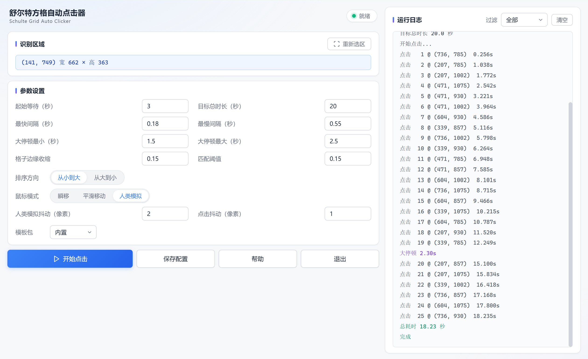

# Schulte Grid Auto Clicker

A Windows desktop tool that **automatically completes Schulte Grid training**.  
It detects the 5×5 number grid on screen and clicks numbers in order from **1 to 25**.  
The clicking rhythm **mimics human behavior** — random intervals, variable speed, and an occasional random pause.

English | [简体中文](README.md)

> This tool is for **learning and automation practice** only. Do not use it to violate the terms of service of any website or application.

---

## Screenshots



---

## Features

- **Template Matching**: No OCR needed. **Fast and accurate** (25 cells in under 50ms).
- **Three Mouse Modes**:
  - **Instant**: Mouse jumps directly to target (default, fastest)
  - **Smooth**: Linear motion over 200–400ms
  - **Human-like**: Bezier curve + variable speed + slight jitter, **most natural**
- **Human-like Rhythm**: Random intervals between clicks, **with one random big pause inserted**.
- **Adjustable Total Time**: The entire click sequence is locked within a specified duration (default ~13s).
- **Multi-font Templates**: Support for multiple template sets for different fonts (`matchTemplates/` folder).
- **Dual Backend**: Web UI + tkinter fallback UI, with **automatic downgrade**.
- **Custom Icon**: Both exe and window icons are replaceable.
- **Invite Code (Optional)**: Invite code required for target duration below 20 seconds.

---

## Quick Start

### Option 1: Download exe (Recommended)

Download the latest `SchulteAutoClicker.exe` from [Releases](https://github.com/clocktool/Schulte/releases), then **double-click to run**.

> System requirement: Windows 10 / 11 (64-bit). Display scaling should be **100%**, otherwise click coordinates may drift.

### Option 2: Run from Source

```bash
git clone https://github.com/clocktool/Schulte.git
cd Schulte
pip install -r requirements.txt
python launcher.py
```

---

## Usage

1. Open the **Schulte Grid** page/application, and make sure all 25 numbers are visible on screen.
2. Open this tool and click **"Select Region"**.
3. The screen will dim. **Hold the left mouse button and drag** to select the entire 5×5 grid (release to finish).
4. Adjust parameters (defaults are fine), then click **"Start"**.
5. Switch to the Schulte Grid window **within 3 seconds**.
6. The program will detect and click automatically.

---

## Dependencies

- **Python** >= 3.10
- [pywebview](https://pywebview.flowrl.com/) == 4.4.1
- [pyautogui](https://github.com/asweigart/pyautogui) — Mouse control
- [mss](https://python-mss.readthedocs.io/) — Screen capture
- [opencv-python](https://opencv.org/) — Image processing
- [numpy](https://numpy.org/) — Numerical computation

Install:

```bash
pip install -r requirements.txt
```

---

## Parameters

| Parameter | Default | Description |
|---|---|---|
| Start Delay (s) | 3 | Time to switch to the target window after clicking Start |
| Target Duration (s) | 20 | Target duration for the whole sequence |
| Fast Interval (s) | 0.18 | Minimum interval between clicks |
| Slow Interval (s) | 0.55 | Maximum interval between clicks |
| Pause Min (s) | 1.5 | Minimum duration of a random pause |
| Pause Max (s) | 2.5 | Maximum duration of a random pause |
| Cell Shrink | 0.15 | Shrink ratio when cropping cells, avoids borders |
| Match Threshold | 0.15 | Similarity threshold, smaller is stricter |
| Sort Order | Ascending | Can be changed to descending |
| Mouse Mode | Instant | Instant / Smooth / Human-like |
| Human Jitter (px) | 2 | Jitter amplitude for human-like mode |
| Click Jitter (px) | 1 | Random offset for each click |

---

## Project Structure

```text
Schulte/
├── launcher.py              # Launcher
├── backend_web.py           # Web backend
├── backend_lite.py          # tkinter fallback backend
├── template_match.py        # Core template matching
├── web/                     # Frontend assets
│   ├── index.html
│   ├── style.css
│   └── app.js
├── templates/               # Built-in templates
│   ├── 1.png
│   ├── 2.png
│   └── ...
├── app.ico
├── requirements.txt
├── LICENSE
├── README.md
└── README.en.md
```

---

## Custom Templates

25 built-in standard number templates are provided (`templates/1.png` ~ `25.png`).

If the target site uses a different font, you can **customize templates**:

1. Create a `matchTemplates/` folder next to the exe.
2. Two structures are supported:

**Single Font**:

```text
matchTemplates/
├── 1.png
├── 2.png
└── ...
```

**Multiple Fonts (Recommended)**:

```text
matchTemplates/
├── SourceHanSans/
│   ├── 1.png ~ 25.png
├── MicrosoftYaHei/
│   ├── 1.png ~ 25.png
└── FangSong/
    └── 1.png ~ 25.png
```

3. The program will **automatically scan** and list available template packs on startup.
4. Select the corresponding template pack in the UI.

> To create templates: **screenshot each digit** from the target site, crop it, and save as `1.png` to `25.png`.

---

## Build to exe

```bash
pyinstaller --onefile --windowed --name SchulteAutoClicker ^
  --icon "app.ico" ^
  --add-data "web;web" ^
  --add-data "templates;templates" ^
  --hidden-import=webview ^
  --hidden-import=webview.platforms.edgechromium ^
  launcher.py
```

---

## FAQ

### Q1: Detection incomplete or wrong?

- **Reselect the region** and make sure the entire 5×5 grid is included
- If the digits are not blue, adjust the color filter in `template_match.py`
- Or **switch to another template pack** (see "Custom Templates" above)

### Q2: Click coordinates drift?

- Check **Windows display scaling**: Settings → System → Display → Scale → set to **100%**
- Or **reselect the region** (the target window may have moved)

### Q3: Clicking has no effect?

- If the target program runs as **administrator**, this program must also run as **administrator**
- And vice versa (permissions must match)

### Q4: Invite code prompt when duration < 20s?

This is a design choice to **prevent tool abuse leading to abnormal scores**. If you need short durations, contact the author for an invite code.

### Q5: WebView2-related errors?

Windows 11 has it built-in; most Windows 10 systems have it too. If not installed, the program **automatically falls back to the tkinter UI**.

### Q6: Antivirus flags it?

Programs packaged with PyInstaller are **often false-flagged**. **Add to whitelist**.

---

## How It Works

1. **Screen Capture**: Capture the target region based on the selected coordinates
2. **Color Separation**: Extract blue digits, convert to black-on-white
3. **5×5 Split**: Split the region into 25 equal cells
4. **Template Matching**: Compare each cell image against the 25 digit templates, take the closest match
5. **Sorting**: Sort by number to get the click order
6. **Simulated Clicking**: Click in human-like rhythm with random intervals and one big pause

---

## License

This project is licensed under the [MIT License](LICENSE).

---

## Disclaimer

This tool is for **learning and automation practice** only. Do not use it to violate the terms of service of any website or application.  
Users assume **full responsibility** for their actions.

---

If this project helps you, please consider giving it a Star.
